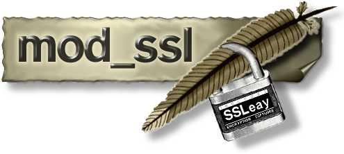

<!SLIDE>
# Convenience vs. Security
## It's often very much a trade-off.

* How many of us remember configuring our first SSL site?
    * It's gonna be so secure!
    * Got me a certificate, yeah...
    * Wait, I have to type in a password during bootup?
    * https://www.google.com/search?q=set+up+apache+ssl+certificate+dont+ask+password

~~~SECTION:notes~~~
It's no real surprise that the top hit for that Google search explains how to
use `SSLPassPhraseDialog` to save the passphrase in a plain-text script.

Most certificate providers these days will sell you a non-encrypted certificate
that does not require a passphrase to use it.
~~~ENDSECTION~~~
