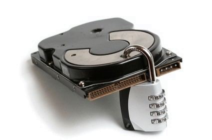

<!SLIDE>
# What about on-disk?
## Keeping secrets out of your codebase.

* We've talked about:
    * keeping secrets out of the catalog.
    * keeping secret files out of the filebucket.
    * keeping secrets out of reports.
* What about the codebase on disk?

