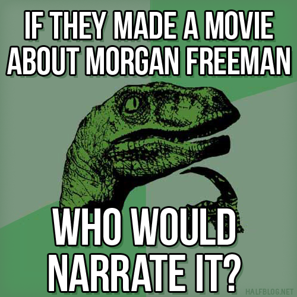

<!SLIDE>
# Remember the bootstrapping problem?
## Puppet's already done some bootstrapping...

* The first thing you do when standing up a new node is sign its certificate!
    * After checking the signature, right?
* Hmmm... time for the hard questions.

<!SLIDE>
# Remember the bootstrapping problem?
## Puppet's already done some bootstrapping...

* The first thing you do when standing up a new node is sign its certificate!
    * After checking the signature, right?
* Hmmm... time for the hard questions.

